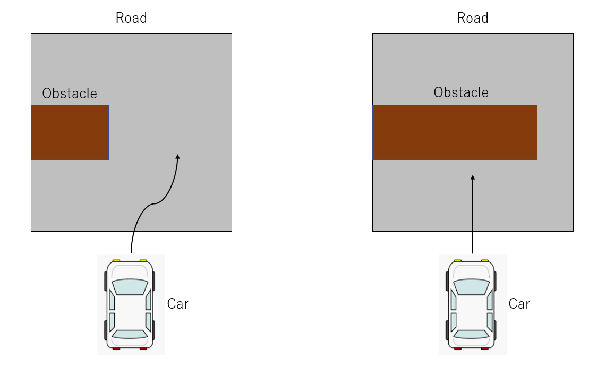
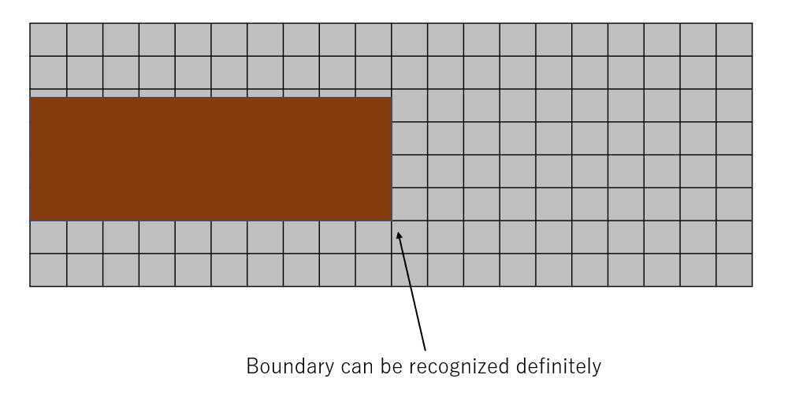
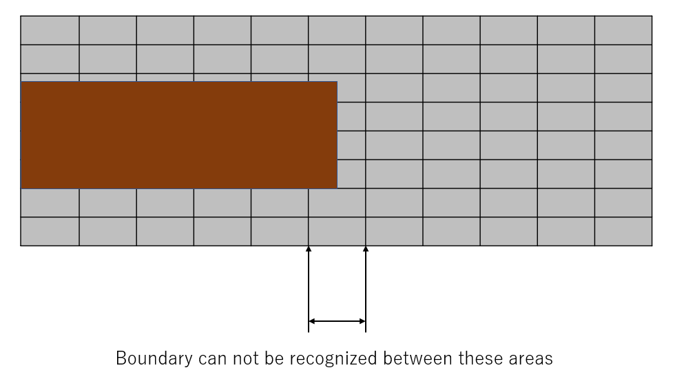
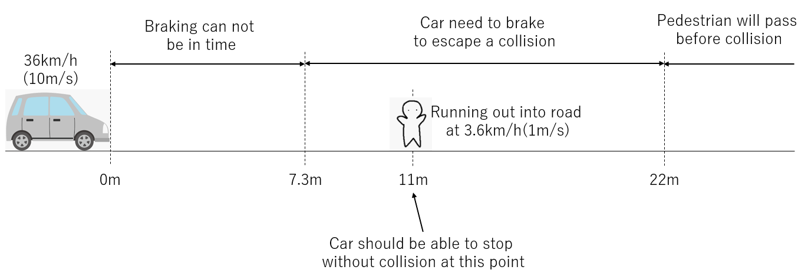
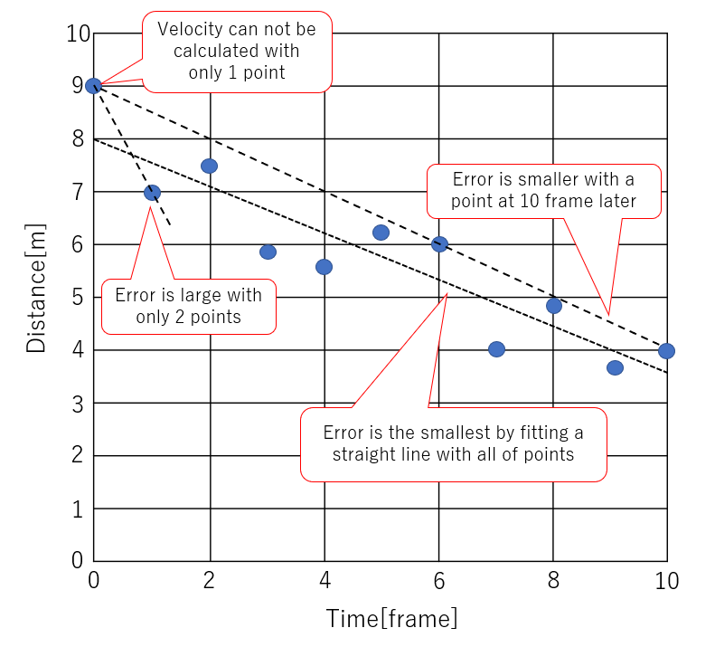
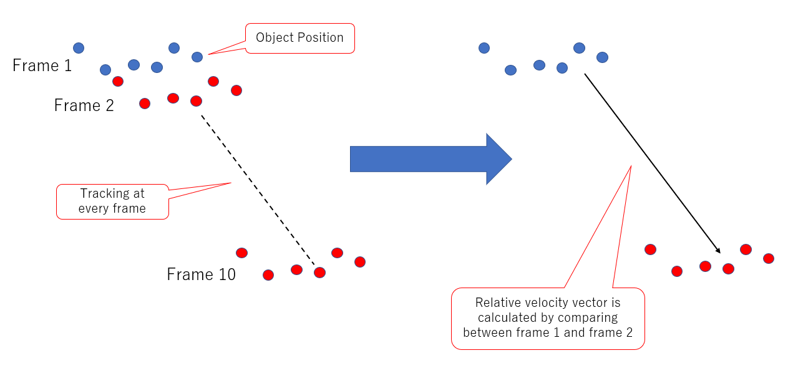
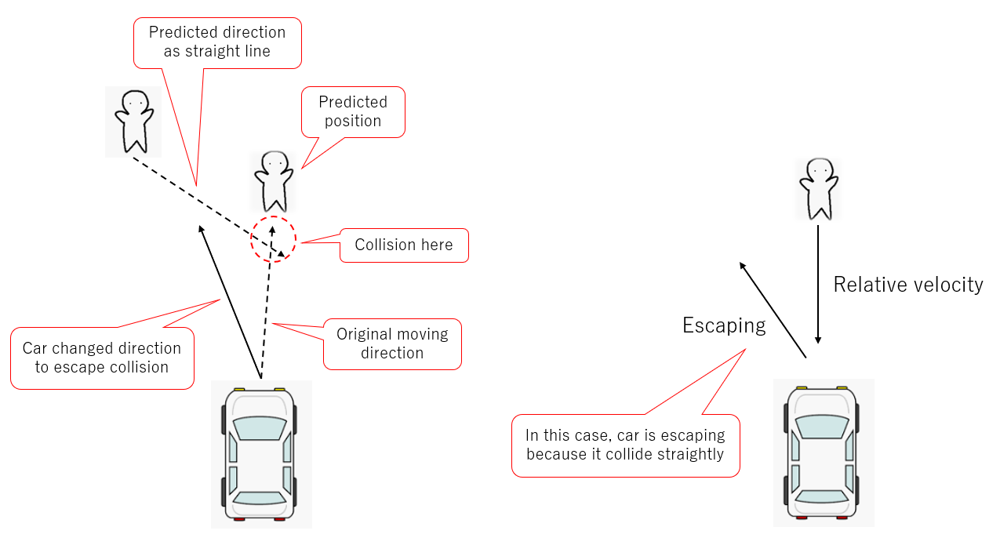
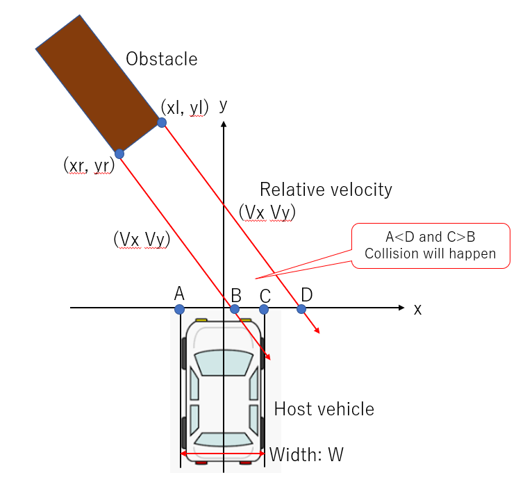

## Table of content
<!-- TOC -->

- [Table of content](#table-of-content)
- [Introduction](#introduction)
- [Reference](#reference)
- [Finding boundary of obstacle](#finding-boundary-of-obstacle)
    - [Taking a detour](#taking-a-detour)
- [Detecting an obstacle in a short term](#detecting-an-obstacle-in-a-short-term)
    - [Case of running out into road](#case-of-running-out-into-road)
    - [How to calculate a braking distance](#how-to-calculate-a-braking-distance)
        - [Free running distance](#free-running-distance)
        - [Braking distance](#braking-distance)
        - [Reference about brake](#reference-about-brake)
    - [How to decide reaction performance](#how-to-decide-reaction-performance)
        - [Distance for halving collision accident](#distance-for-halving-collision-accident)
    - [Calculating relative velocity](#calculating-relative-velocity)
    - [Predicting obstacle behavior](#predicting-obstacle-behavior)
    - [Judging the object is obstacle or not](#judging-the-object-is-obstacle-or-not)

<!-- /TOC -->

## Introduction

Obstacle detection system needs multiple functions to detect an obstacle and escape a collision. When we develop the system, it is very important to decide that the system should have what kind of function and how performance the functions should satisfy.  
In this article, I'm introducing how to consider functions and performance the obstacle detection system should satisfy.  

## Reference

I read the following book as a reference. This book has good exlanations about techniques of perception with LiDAR, RADAR and Camera.  
[トランジスタ技術2019年3月号](https://www.amazon.co.jp/%E3%83%88%E3%83%A9%E3%83%B3%E3%82%B8%E3%82%B9%E3%82%BF%E6%8A%80%E8%A1%93-2019%E5%B9%B4-03%E6%9C%88%E5%8F%B7/dp/B07MFM728X/ref=sr_1_6?__mk_ja_JP=%E3%82%AB%E3%82%BF%E3%82%AB%E3%83%8A&crid=MPFWCSQ48JBI&keywords=%E3%83%88%E3%83%A9%E3%83%B3%E3%82%B8%E3%82%B9%E3%82%BF%E6%8A%80%E8%A1%93&qid=1561774997&s=gateway&sprefix=%E3%83%88%E3%83%A9%E3%83%B3%E3%82%B8%E3%82%B9%E3%82%BF%2Caps%2C1016&sr=8-6)  

## Finding boundary of obstacle

There are two ways of escaping a collision with an obstacle as follow.  

* Stopping by brake
* Taking a detour by handle

### Taking a detour

An important information when the car escape an obstacle by taking a detour is "How is a colliding object blocking a road?" Especially, It is important to recognize where a lateral boundary of the object is.  
The follwing figures are two patterns of escaping. On the left figure, an obstacle does not occupancy much on the road area, so the car can change the moving direction and escape the obstacle. On the other hand, the area where the obstacle occupancies is very large on the right figure. There is not enough to escape the obstacle, so the car should stop driving before colliding with the obstacle.  
  

If the obstacle was sensed as an image data by a camera, the position of lateral boundary can be recognized easily like the following figure because the image data has a high resolution on the lateral direction.  
  

On the other hand, if the obstacle was detected by a sensor which has a low lateral resolution like a LiDAR, the position of lateral boundary can not be recognized as follow.  
  

## Detecting an obstacle in a short term

This system should not take a long time to detect an obstacle. Firstly, we need to decide a concrete valuable of time to detect the obstacle. The valueable is used for designing the system as a target valuable of processing speed.  

### Case of running out into road
We assumed that the car was driving at 36km/h(10m/s) and a pedestrian ran out into the road at 3.6km/h(1m/s). In this case, how far will the car move for until stopping by sudden brake?  
  

### How to calculate a braking distance
A distance from point where a driver decided braking to a point where the car stopped is called "Stop distance". And then, "Stop distance" is divided into "Free running distance" and "Braking distance".  
Stop distance = Free running distance + Braking distance  

#### Free running distance
This distance is from a point where a driver decided braking to a point where the brake started working. This is calculated by the following equation.  
Free running distance = Reaction time[s] × Initial velocity[m/s]  

#### Braking distance
This distance is from a point where the brake started working to a point where the car stopped. This is calculated by the following equation.  
Braking distance = (Initial velocity[m/s])^2 / (2$\mu g$)  
$\mu$ is coefficient of friction between a tire and ground.  
$g$ is gravitational acceleration.  

#### Reference about brake
* [ブレーキに関する常識を覆す 車両重量と制動距離の真の関係](https://macasakr.sakura.ne.jp/braking.html#7)  
* [交通事故における車速と停止距離を考える](http://www5d.biglobe.ne.jp/Jusl/Keisanki/JTSL/TeisiSyasoku.html)  

### How to decide reaction performance
Braking force of sudden brake by human is 70% of gravitational acceleration. 9.8m/s is expressed as $1g$. When the velocity is at 36km/h(10m/s), braking distance is 7.3m as the following calculation.  
7.3[m] = (Initial velocity[m/s])^2 / (2×0.7×$g$)

This mean that the car will collide with the pedestrian if he ran out into the road before 7.3m. And then, if the pedestrian passed through the road while the car moved, they would not collide each other.  
For example, when a width of car is 1.7m and a width of pedestrian is 0.5m, it takes for 2.2 second to pass through the road. So, if he ran out into the road longer than 22m, he would not be collided by the car.  

#### Distance for halving collision accident
When the pedestrian ran into the road at 11m by half of 22m, if the car could stop by sudden braking, a collision accident would be reduced by half. The car needs 7.3m to stop by sudden braking. It has to detect the pedestrian and judge a possibility of collision during the rest of distance, 3.7m.  

### Calculating relative velocity
The velocity of car is 10m/s and it takes 0.37 sec to move until 3.7m. The detection process need to be executed during 0.37 sec. In this situation, a relative velocity is used for judging the possibility of collision. The relative velocity can be calculated as follow figure.  

  

The system can get an accurate relative velocity data by using more than 2 sequential range data. If 10 frames data was observed during short time, the calculated relative velocity would be very accurate like the following figure.  
  

### Predicting obstacle behavior
Not only position but also vector of relative behavior should be predicted to escape collision. The following 2 figures are how to predict by manual driving car and by autonomous driving car.  
The following left side figure is how to predict by manual driving car. When a human driver drives in escaping collision, he predicts other object's behavior.  
On the other hand, the right side figure is how to predict by autonomous driving car. The car need to calculate a relative velocity vector between itself and the other object. The system can predict the other object's behavior by assuming that the velocity vector doesn't change during short time.  
  

### Judging the object is obstacle or not
The system can judge the other object is obstacle or not with the relative velocity vector. And then, TTC(Time to collision) can be calculated by dividing the range to the other object by the absolute relative velocity vector.  
  
When a relative angle of the other object: $tan^{-1}(x/y)$ and a relative angle: $tan^{-1}(V_x / V_y)$ are same, the host vehicle collides with the other obejct. In fact, they have a width of their body. Even if it was not head-on collision, they would collide each other when they overlapped.  
On the other hand, when the following condition was satisfied, they will not collide each other.  
$$
    tan^{-1}(\frac{V_x}{V_y}) > tan^{-1}(\frac{x_l-\frac{W}{2}}{y_l})
$$  
$$
    tan^{-1}(\frac{V_x}{V_y}) < tan^{-1}(\frac{x_r-\frac{W}{2}}{y_r})
$$